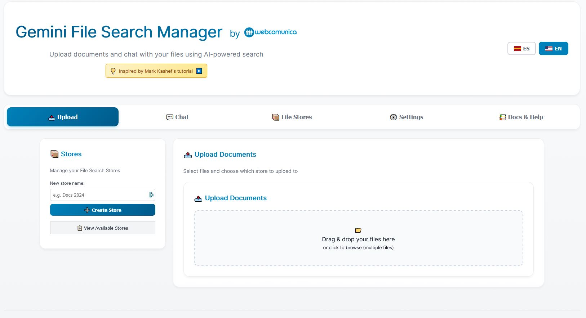
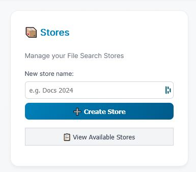
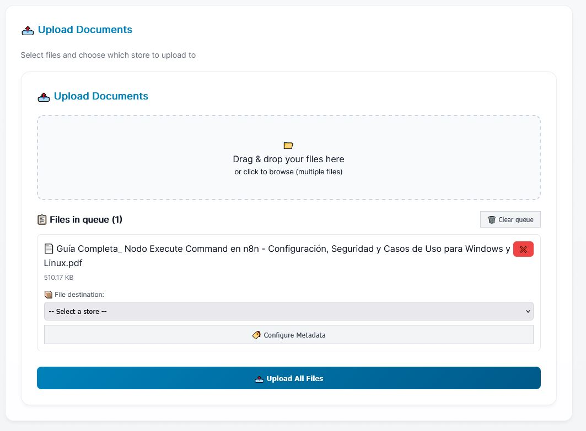
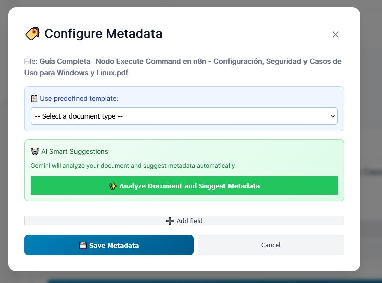
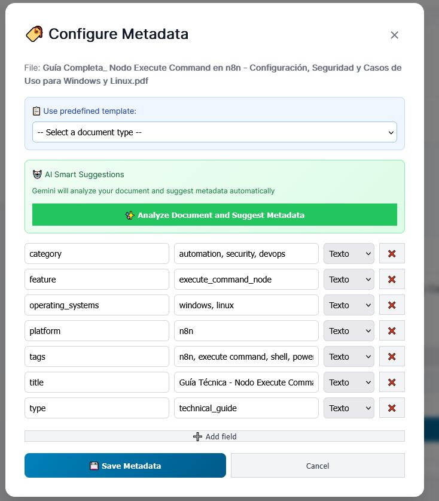
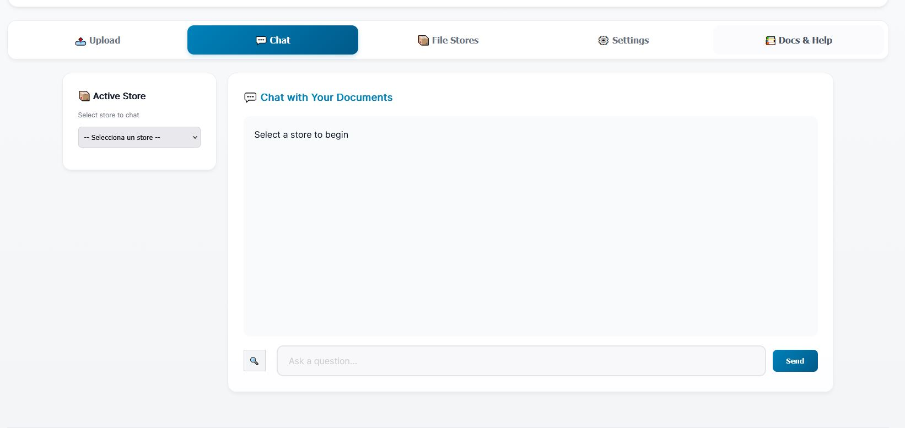
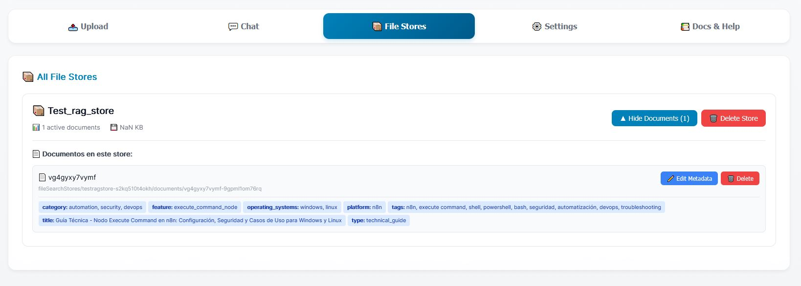
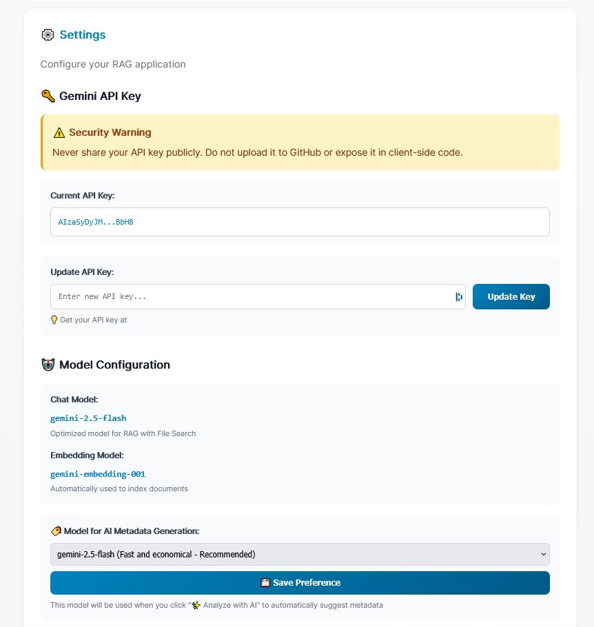
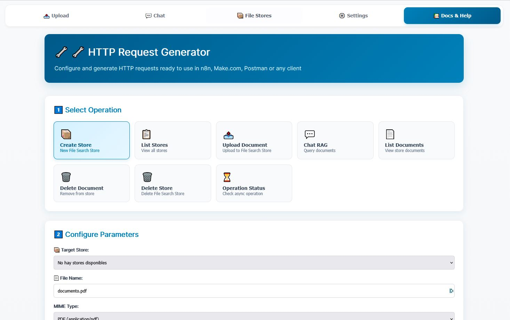
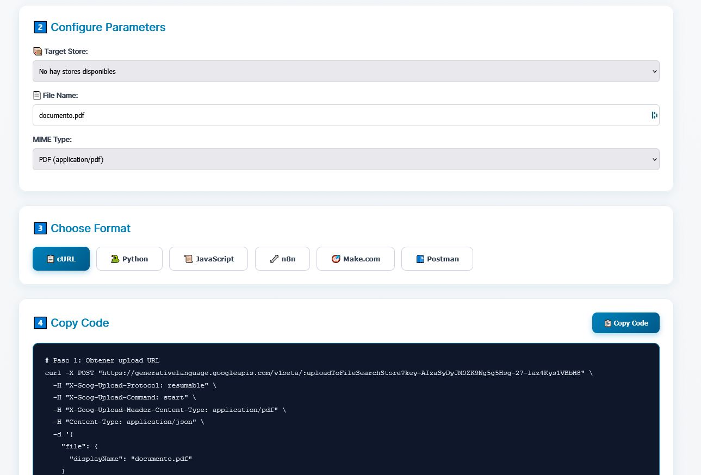

# 📸 Screenshots Gallery

Detailed visual guide to all features of Gemini File Search Manager.

---

## 01. Main Interface



**Features Shown:**
- Clean, modern interface with bilingual support (ES/EN language toggle)
- Four main navigation tabs: Upload, Chat, File Stores, Settings, and Docs & Help
- Left sidebar with store creation panel
- Right panel with file upload drag & drop area
- Webcomunica branding and attribution to Mark Kashef's tutorial

**What You Can Do:**
- Switch between Spanish and English instantly
- Create new File Search Stores
- Upload documents with drag & drop or file browser
- Navigate between different sections

---

## 02. Stores Management Panel



**Features Shown:**
- Store creation form with name input
- "Create Store" button
- "View Available Stores" option to see all existing stores

**What You Can Do:**
- Create new File Search Stores with custom names
- View and manage existing stores
- Quick access to store operations

---

## 03. Upload Queue with File



**Features Shown:**
- File successfully added to upload queue
- Document name: "Guía Completa_ Nodo Execute Command en n8n"
- File size: 510.17 KB
- Store destination selector dropdown
- "Configure Metadata" button (highlighted)
- "Upload All Files" button to process the queue

**What You Can Do:**
- Add multiple files to queue before uploading
- Select target store for each file
- Configure custom metadata before upload
- Clear queue or remove individual files
- Batch upload all queued files

---

## 04. Metadata Configuration Modal (Empty)



**Features Shown:**
- Metadata configuration dialog for the selected file
- "Use predefined template" dropdown for quick setup
- **AI Smart Suggestions** section (highlighted in green)
- "Analyze Document and Suggest Metadata" button with AI icon
- Manual "Add field" option
- Save/Cancel buttons

**What You Can Do:**
- Use predefined templates for common document types (invoice, contract, report, etc.)
- Let Gemini AI automatically analyze and suggest metadata
- Manually add custom metadata fields
- Choose between string and numeric field types

---

## 05. AI Metadata Suggestions (Filled)



**Features Shown:**
- Metadata fields automatically populated by Gemini AI:
  - **category**: automation, security, devops
  - **feature**: execute_command_node
  - **operating_systems**: windows, linux
  - **platform**: n8n
  - **tags**: n8n, execute command, shell, powershell, bash, security
  - **title**: "Guía Técnica - Nodo Execute Command..." (extracted from content, NOT filename)
  - **type**: technical_guide
- Field type selectors (Text/Number)
- Remove buttons for each field
- "Add field" button for additional metadata

**What You Can Do:**
- Review AI-suggested metadata
- Edit any suggested values
- Remove unwanted fields
- Add additional custom fields
- Save metadata to document

**Key Feature:** The AI extracts the "title" from document CONTENT, not from the filename.

---

## 06. Chat Interface



**Features Shown:**
- Active Store selector (dropdown)
- Large chat area with "Chat with Your Documents" header
- Message input box with placeholder "Ask a question..."
- Send button
- Clean, ready-to-use interface
- Prompt: "Select a store to begin"

**What You Can Do:**
- Select which store to query
- Ask natural language questions about uploaded documents
- Get AI-powered responses with citations
- View conversation history
- Real-time RAG (Retrieval Augmented Generation)

---

## 07. File Stores Management



**Features Shown:**
- "All File Stores" section
- Store card showing:
  - Store name: "Test_rag_store"
  - 1 active document
  - Size: NaN KB (calculated dynamically)
  - "Hide Documents" toggle button
  - "Delete Store" button (red)
- Expanded documents list showing:
  - Document ID: vg4gyxy7vymf
  - Full Gemini path
  - All metadata displayed as clickable tags (blue and purple):
    - category, feature, operating_systems, platform, tags, title, type
  - "Edit Metadata" button (blue)
  - "Delete" button (red)

**What You Can Do:**
- View all File Search Stores
- See document count and storage size per store
- Expand/collapse document lists
- View full metadata for each document
- Edit metadata without re-uploading
- Delete individual documents
- Delete entire stores (with force option)

---

## 08. Settings Page



**Features Shown:**
- **Gemini API Key** section with:
  - Security warning (yellow alert box)
  - Current API key display (partially masked: AIzaSy0yJM...BbH8)
  - Update API Key input field
  - Link to get API key
  - "Update Key" button

- **Model Configuration** section showing:
  - **Chat Model**: gemini-2.5-flash (Optimized for RAG with File Search)
  - **Embedding Model**: gemini-embedding-001 (Automatically used to index documents)
  - **Model for AI Metadata Generation**: gemini-2.5-flash selector
  - "Save Preference" button
  - Explanation: "This model will be used when you click 'Analyze with AI'"

**What You Can Do:**
- View current API key (masked for security)
- Update API key
- See which models are configured for:
  - RAG chat queries
  - Document embedding
  - AI metadata generation
- Change AI metadata model preference
- Save configuration for future sessions

**Security Note:** The warning reminds users never to share or expose API keys publicly.

---

## 09. API Documentation - HTTP Request Generator



**Features Shown:**
- **"HTTP Request Generator"** header
- Description: "Configure and generate HTTP requests ready to use in n8n, Make.com, Postman or any client"
- **Step 1: Select Operation** with 7 operation cards:
  - Create Store (New File Search Store) - highlighted
  - List Stores (View all stores)
  - Upload Document (Upload to File Search Store)
  - Chat RAG (Query documents)
  - List Documents (View store documents)
  - Delete Document (Remove from store)
  - Delete Store (Delete File Search Store)
  - Operation Status (Check async operation)

- **Step 2: Configure Parameters**
  - Target Store dropdown
  - File Name input field
  - MIME Type selector

**What You Can Do:**
- Select from 8 different Gemini API operations
- Fill in required parameters
- Generate ready-to-use HTTP requests
- Copy code for immediate use
- Supported formats: cURL, Python, JavaScript, n8n, Make.com, Postman

---

## 10. API Documentation - Code Examples



**Features Shown:**
- **Step 3: Choose Format** with 6 format buttons:
  - cURL (selected - blue highlight)
  - Python
  - JavaScript
  - n8n
  - Make.com
  - Postman

- **Step 4: Copy Code** section with:
  - "Copy Code" button
  - Code block showing actual cURL command:
    ```bash
    # Paso 1: Obtener upload URL
    curl -X POST "https://generativelanguage.googleapis.com/v1beta/..."
    -H "X-Goog-Upload-Protocol: resumable"
    -H "X-Goog-Upload-Command: start"
    -H "X-Goog-Upload-Header-Content-Type: application/pdf"
    -H "Content-Type: application/json"
    -d '{
      "file": {
        "displayName": "documento.pdf"
      }
    }'
    ```

**What You Can Do:**
- Choose your preferred format/language
- View complete, working code examples
- Copy code to clipboard with one click
- Use immediately in your workflow/application
- Learn the Gemini File Search API structure

**Formats Available:**
1. **cURL**: Command-line HTTP requests
2. **Python**: Using `requests` library
3. **JavaScript**: Using `fetch` API
4. **n8n**: For workflow automation
5. **Make.com**: For visual automation
6. **Postman**: For API testing

---

## Feature Highlights Across Screenshots

### 🌍 Bilingual Support
- Visible in screenshots 1, 6, 7, 8, 9
- Instant ES/EN language toggle
- All UI elements translated

### 🤖 AI-Powered Metadata
- Visible in screenshots 4, 5
- Automatic document analysis
- Smart field extraction
- Title extraction from content (not filename)

### 🗂️ Store Management
- Visible in screenshots 2, 7
- Multiple stores support
- Document tracking
- Metadata editing

### 💬 RAG Chat
- Visible in screenshot 6
- Natural language queries
- Citation support
- Conversation history

### ⚙️ Configuration
- Visible in screenshot 8
- API key management
- Model selection
- Preference persistence

### 🔧 Developer Tools
- Visible in screenshots 9, 10
- HTTP request generator
- 6 output formats
- Ready-to-use code

---

## Technology Stack Visible in Screenshots

- **Frontend**: Clean, modern HTML5/CSS3/JavaScript interface
- **Backend**: Flask-powered Python application
- **AI**: Google Gemini 2.5 Flash & Embedding models
- **Storage**: File Search Stores with persistent metadata
- **Architecture**: Single-page application with tab navigation

---

## User Experience Highlights

1. **Drag & Drop**: Simple file upload (screenshot 1, 3)
2. **Queue System**: Batch processing support (screenshot 3)
3. **AI Assistance**: One-click metadata generation (screenshot 5)
4. **Visual Feedback**: Tags, colors, icons throughout
5. **Safety**: Confirmations for destructive actions
6. **Developer-Friendly**: Code generation in multiple formats

---

**Last Updated**: November 20, 2024
